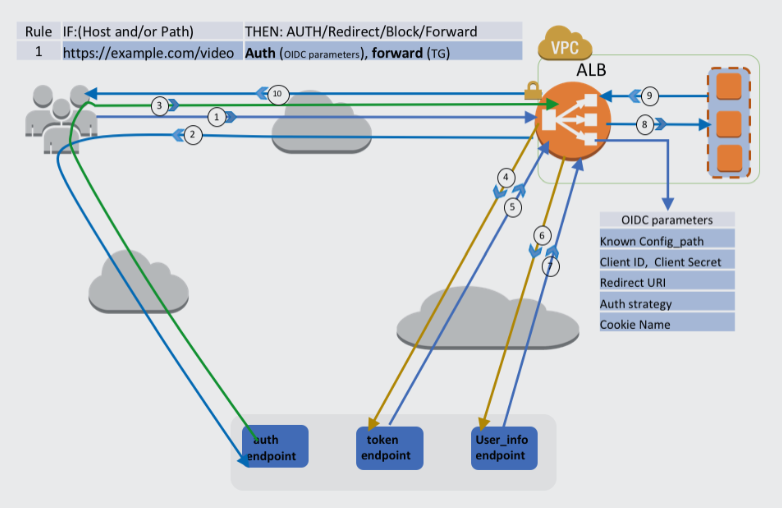

footer: プロダクト勉強会 2018/06/04 - Ozawa Shuhei
slidenumbers: true
autoscale: true

# [fit] **Amazon Web Services**
## **最新動向2018**

--- 

# **Agenda**

- re:Invent 2017発表サマリー
- AWS Summit Tokyo発表サマリー
- その他リリース情報
- その他発表
- ALBが認証ログインのフロー
- AWSお役立ち情報

---

## **re:Invent 2017発表サマリー(1)**

- EC2のM5インスタンスファミリを発表
→2018/04/09 EC2 [M5](https://aws.amazon.com/jp/about-aws/whats-new/2018/04/amazon-ec2-m5-instances-are-now-available-in-tokyo-and-sao-paulo-regions/)/[C5](https://aws.amazon.com/jp/about-aws/whats-new/2018/04/amazon-ec2-c5-instances-are-now-available-in-seoul-and-tokyo-regions/)インスタンスタイプが東京リージョンで利用可能
- EC2ベアメタルインスタンスを発表
→2018/05/17[ベアメタル I3 インスタンス公開 not Tokyo](https://aws.amazon.com/jp/about-aws/whats-new/2018/05/announcing-general-availability-of-amazon-ec2-bare-metal-instances/)
→[EC2ベアメタルを支える技術](https://www.publickey1.jp/blog/18/aws_nitro_system.html)
- [Amazon GuardDuty](https://docs.aws.amazon.com/ja_jp/guardduty/latest/ug/what-is-guardduty.html)を発表
→CloudTrailやDNSのログ、VPC Flow Logs等のデータから疑わしいアクティビティを検知する
→エージェント等は不要。性能影響もない。
→処理したログ量に応じた課金体系
- [スポットインスタンスの価格変動が緩やかになったらしい](https://dev.classmethod.jp/cloud/aws/spot-ec2-smooth-price-changes/)

---

## **re:Invent 2017発表サマリー(2)**

- AWS Fargate発表
→[AWS Fargate の 東京リージョン対応予定](https://aws.amazon.com/jp/blogs/news/aws-fargate-tokyo-launch/)
- Amazon EKSを発表
→Kubernetesのマネージドサービスで2018/06現在[プレビュー](https://aws.amazon.com/jp/eks/)のみ
- Amazon Aurora Multi-Masterを発表
→MySQL 互換版の新機能で複数のAZにわたって書き込みパフォーマンスをスケールアウトする機能が追加
→2018/06現在[プレビュー](https://aws.amazon.com/jp/about-aws/whats-new/2017/11/sign-up-for-the-preview-of-amazon-aurora-multi-master/)のみ
- Amazon Aurora Serverlessを発表
→インスタンスを意識することなく利用できるAuroraのオンデマンド自動スケーリング設定
→DBのキャパシティーがアプリのニーズに基づいて自動的に起動、シャットダウン、スケールアップ、ダウンされる
→2018/06現在[プレビュー](https://aws.amazon.com/jp/rds/aurora/serverless/)のみ

---

## **re:Invent 2017発表サマリー(3)**

- Amazon S3 Selectを発表
→[2018/04/04一般公開](https://aws.amazon.com/jp/about-aws/whats-new/2018/04/amazon-s3-select-is-now-generally-available/)
→オブジェクトから必要なデータのみを抽出してくれる機能
- [Amazon Glacier Select](https://aws.amazon.com/jp/about-aws/whats-new/2017/11/amazon-glacier-select-makes-big-data-analytics-of-archive-data-possible/)を発表
→Glacierに保存されたデータに対して直接クエリを実行できるようになり、分析に使用するアーカイブから必要なデータのみを取得可能
- インターリージョンVPCピアリングを発表
→通信はデフォルトで暗号化される。リージョン間の通信はAWSが管理する回線を使用する。
→異なるリージョン間でもVPCピアリングが可能になった
→2018/02/21[東京も利用可能](https://aws.amazon.com/jp/blogs/news/inter-region-vpc-peering-is-now-available-in-nine-additional-aws-regions/)

---

## **re:Invent 2017発表サマリー(4)**

- AWS WAFでマネージドルールが利用可能になった
→今までは攻撃に対する防御に利用するルールを自分で作成する必要性があった
→マネージドルールは AWS セキュリティの販売者によって自動的に更新される
→マネージドルールはAWSのMarketplacesから利用可能。従量課金。
→[2018/02/28には提供する出品者はF5 Networks、Imperva、Fortinet、Trend Micro、Alert Logic、TrustWaveになった](https://aws.amazon.com/jp/about-aws/whats-new/2018/02/new-products-for-managed-rules-on-aws-waf/)

---

## **re:Invent 2017発表サマリー(5)**

- [Launch Templates for Amazon EC2 instances](https://aws.amazon.com/jp/about-aws/whats-new/2017/11/introducing-launch-templates-for-amazon-ec2-instances/)発表
→起動時の設定をテンプレート化できるようになった
- [スプレッドプレイスメントグループ](https://docs.aws.amazon.com/ja_jp/AWSEC2/latest/UserGuide/placement-groups.html)
→インスタンス起動時に異なるハードウェアに配置されるインスタンスのグループ
→物理サーバ障害時に複数のインスタンスが同時に影響受ける可能性を軽減
→AZまたいでの設定が可能

---

## **re:Invent 2017発表サマリー(6)**

- [T2 Unlimited](https://docs.aws.amazon.com/ja_jp/AWSEC2/latest/UserGuide/t2-unlimited.html)インスタンス発表
→実行中または停止中の T2 インスタンスに対して、起動時に設定またはいつでも有効にできる
→CPUのバーストクレジットが枯渇しても、継続してCPUリソースを使い続けられる
→向こう24時間に付与されるクレジットを前借りしてバーストを継続する
→それも使い切ったときは有償でバーストを継続可能

---

## **re:Invent 2017発表サマリー(7)**

- [Amazon Time Sync Service のご紹介](https://aws.amazon.com/jp/about-aws/whats-new/2017/11/introducing-the-amazon-time-sync-service/)
→マネージドのNTPサービスでVPC内で実行される EC2 インスタンスなら追加料金無しで利用可能
→うるう秒対応済
→[C5/M5インスタンスも利用可能になった](https://aws.amazon.com/jp/blogs/aws/keeping-time-with-amazon-time-sync-service/)

---

## **AWS Summit Tokyo2018発表サマリー** 

- [Amazon Elastic File System (EFS)](https://aws.amazon.com/jp/blogs/news/amazon-elastic-file-system-efs-nrt/)の東京リージョン対応がアナウンス
→2018年7月リリース予定
→EC2インスタンスにマウントして利用する形になる。
→EBSと違い複数のEC2インスタンスからマウント可能な共有のファイルストレージ
→複数のAZで冗長的に保存される。
- [AWS Loft Tokyo](https://aws.amazon.com/jp/blogs/startup/announcing_loft_tokyo/)が10月オープン予定
→AWSのソリューション・アーキテクト(SA)をはじめとする技術者陣が常駐していて相談にのってくれるらしい
→無料で利用できる「コ・ワーキングスペース」があるらしい
→セミナーや勉強会も開催するとのこと

---

## **その他リリース情報(1)**

- [Amazon Virtual Private Cloud (VPC) で、お客様による Elastic IPアドレスのタグ付けが可能に](https://aws.amazon.com/jp/about-aws/whats-new/2017/12/amazon-virtual-private-cloud-vpc-now-allows-customers-to-tag-their-elastic-ip-addresses/)
→Elastic IP の検索、フィルタ、整理のためにキーと値のメタデータを追加できるようになった
- [Amazon Elasticsearch Service が、Amazon Cognito を使用する Kibana のユーザー認証とアクセスを簡素化](https://aws.amazon.com/jp/about-aws/whats-new/2018/04/amazon-elasticsearch-service-simplifies-user-authentication-and-access-for-kibana-with-amazon-cognito/)
→kibanaへの認証はIAMポリシーがサポートされてないので、パブリックアクセスかVPC アクセスしかなかったが、Cognitoによる認証ができるようになった
- [Amazon CloudFront 日本で9番目のエッジロケーション](https://aws.amazon.com/jp/blogs/news/amazon-cloudfront-new-edge-location-tokyo/)がリリース
- [IAM ポリシーの使用により、AWS リージョンへのアクセス管理が容易に](https://aws.amazon.com/jp/about-aws/whats-new/2018/04/requested-region-context-key/)
→IAMで新しいグローバル条件キー「aws:RequestedRegion」を追加することで特定のリージョンへのアクセスを管理することができるようになった
- [Amazon EC2 C5d インスタンスのご紹介 not Tokyo](https://aws.amazon.com/jp/about-aws/whats-new/2018/05/introducing-amazon-ec2-c5d-instances/)
→インスタンスタイプがインスタンスストアと同じで、揮発性のSSDなのでインスタンスを停止すると、データ消えるやつ。

---

## **その他リリース情報(2)**

- [Amazon Aurora Backtrack – 時間を巻き戻す](https://aws.amazon.com/jp/blogs/news/amazon-aurora-backtrack-turn-back-time/)
→巻き戻し機能を開始すると、Aurora はDBを一時停止し、すべての接続を遮断して、コミットされていない書き込みをドロップし、巻き戻し機能が完了するのを待つ。その後、通常のオペレーションを再開して、リクエストを受け入れる。
→DBの設定変更するテスト実施後にテストデータベースを復元などもできる。 
→分散型ログ構造ストレージシステムのpaperのリンク有り
- [【アップデート】Amazon Auroraでスロークエリや一般ログがCloudWatch Logsへ出力可能に](https://dev.classmethod.jp/cloud/aws/amazon-aurora-export-cloudwatch-logs/)
→Amazon Auroraのスロークエリログ、一般ログ、エラーログをCloudWatch Logsへ出力可能になった
- [Amazon EC2のAuto Recoveryが専用インスタンスで利用可能になりました](https://aws.amazon.com/jp/about-aws/whats-new/2018/05/amazon-ec2-auto-recovery-is-now-available-for-dedicated-instances/)
- [Amazon ECS、コンテナの起動時間を高速化するオプションを追加](https://aws.amazon.com/jp/about-aws/whats-new/2018/05/amazon-ecs-adds-options-to-speed-up-container-launch-times/)
→ コンテナが起動されるたびにレジストリからコンテナのイメージをダウンロードしていましたが、ECS ホストにキャッシュされたコンテナイメージを使用するように Amazon ECS を設定することができるようになった。
- [ALBが認証ログインをサポートした](https://aws.amazon.com/jp/blogs/aws/built-in-authentication-in-alb/?sc_channel=sm&sc_campaign=launch_&sc_publisher=TWITTER&sc_country=Global&sc_geo=GLOBAL&sc_outcome=awareness&trkCampaign=sm_ELB_d1829990_authentication_on_Application_Load_Balancer&trk=_TWITTER&sc_content=ELB_d1829990_authentication_on_Application_Load_Balancer&sc_category=Elastic_Load_Balancing&linkId=52376137)
→ALBの新しい認証アクションは、Amazon Cognitoを通じてGoogle、Facebook、Amazonなどのソーシャルアイデンティティプロバイダー（IdP）を通じて認証を提供

---

OIDC IdP(Facebookログイン)のALB認証 フロー
- ALBはセッションクッキーをチェックし、セッションクッキーがない場合はユーザーをIdPにリダイレクト
- IdPで認証後ユーザーは認証コードでALBに戻る
- ALBはIdPでコードを認証し、IDトークンとアクセストークンを受信します
- ALBはIdPを使用してユーザー情報のアクセストークンを交換
- ALBはユーザー情報に署名し、HTTP経由でバックエンドに送信
- ALBはユーザー応答にセッションクッキーを追加
- ユーザーがセッションCookieを使用しHTTP要求を送信し、ALBが要求をバックエンドに直接転送

---

## **その他発表(1)**

[新しい AWS サービスに関する 4 つの無料デジタルトレーニングコースを発表](https://aws.amazon.com/jp/about-aws/whats-new/2018/04/four-digital-courses-on-new-AWS-services/)
[AWS ドキュメントがオープンソースになり、GitHub で利用可能になった](https://github.com/awsdocs)
[AWS 認定セキュリティ - 専門試験の発表](https://aws.amazon.com/jp/about-aws/whats-new/2018/04/aws-certified-security-specialty/)
[AWS 認定ソリューションアーキテクト – アソシエイト試験内容更新](https://aws.amazon.com/jp/certification/certified-solutions-architect-associate/?sc_channel=sm&sc_campaign=AWS_Training&sc_publisher=TWITTER&sc_country=Japan&sc_geo=JAPAN&sc_outcome=awareness&trk=_TWITTER&sc_content=%E3%80%90%E8%A9%A6%E9%A8%93%E5%86%85%E5%AE%B9%E3%82%92%E6%9B%B4%E6%96%B0%E3%81%97%E3%81%BE%E3%81%97%E3%81%9F%E3%80%91AWS%E8%AA%8D%E5%AE%9A%E3%82%BD%E3%83%AA%E3%83%A5%E3%83%BC%E3%82%B7%E3%83%A7%E3%83%B3%E3%82%A2%E3%83%BC%E3%82%AD%E3%83%86%E3%82%AF%E3%83%88%E2%80%93%E3%82%A2%E3%82%BD%E3%82%B7%E3%82%A8%E3%82%A4%E3%83%88&linkId=51816073)

---

## **AWSお役立ち情報(1)**

- [AWSがServerless Application Model (SAM)の実装をオープンソース化し、機能を拡張](https://www.infoq.com/jp/news/2018/05/serverless-application-model-oss?utm_campaign=infoq_content&utm_source=infoq&utm_medium=feed&utm_term=global)
→Cloud Formation の拡張で、Lambda、API GW、DynamoDB の構築をより簡単に行える仕組み。位置づけとしては、Serverless Framework と同じ。
- [AWS Health Tools リポジトリを発表](https://aws.amazon.com/jp/blogs/news/announcing-the-aws-health-tools-repository/)
→aws-health-toolsを使えばチャットツールやSNS通知に自動化できる
- [新機能 – インタラクティブな AWS コストエクスプローラー API](https://aws.amazon.com/jp/blogs/news/new-interactive-aws-cost-explorer-api/)
→[aws-cost-explorer-report](https://github.com/aws-samples/aws-cost-explorer-report)でアカウントのコストやメトリクスの使用量を取得できる
→API コールごとに 0.01 USD
- [AWS サポート API](https://docs.aws.amazon.com/ja_jp/awssupport/latest/user/Welcome.html)
→サポートケース管理がAPI経由でできる
→Redmineと連携させて過去のサポートケースをためておくのは良いのかもしれない。

---

## **AWSお役立ち情報(2)**

[国内のクラウドセミナー・イベントスケジュール](https://aws.amazon.com/jp/about-aws/events/)
[AWSオンラインセミナースケジュール](https://aws.amazon.com/jp/about-aws/events/webinars/?sc_channel=sm&sc_campaign=AWS_BlackBelt,AWS_Blog,Webinars&sc_publisher=TWITTER&sc_country=Japan&sc_geo=JAPAN&sc_outcome=awareness&trk=_TWITTER&sc_content=%E5%A4%B1%E6%95%97%E4%BE%8B%E3%82%92%E6%88%90%E5%8A%9F%E3%81%AB%E5%A4%89%E3%81%88%E3%82%8BAWS%E3%82%A2%E3%83%B3%E3%83%81%E3%83%91%E3%82%BF%E3%83%BC%E3%83%B3&linkId=52156751)
[Amazon Web Services ブログ](https://aws.amazon.com/jp/blogs/news/)
[AWS Compute Blog](https://aws.amazon.com/jp/blogs/compute/)
[AWS Database Blog](https://aws.amazon.com/jp/blogs/database/)
[AWS アーキテクチャセンター](https://aws.amazon.com/jp/architecture/)
[AWS Samples](https://github.com/aws-samples?page=1)
[AWS の最新情報](https://aws.amazon.com/jp/new/?sc_channel=sm&sc_campaign=Launch_Videos&sc_publisher=TWITTER&sc_country=Japan&sc_geo=JAPAN&sc_outcome=awareness&trk=_TWITTER&sc_content=AWSServiceUpdate%E5%8B%95%E7%94%BB%E5%85%AC%E9%96%8B180529&linkId=52292245)
[AWS Service Update](https://www.youtube.com/playlist?list=PLzWGOASvSx6HWttdnuxjhH26ghWIC7pUk)
[AWS Podcast | Listen & Learn About AWS](https://aws.amazon.com/jp/podcasts/aws-podcast/)

---

## **AWSお役立ち情報(3)**

[AWS 全サービスを 3行で説明](http://x68000.q-e-d.net/~68user/cloud/allservice-aws.html)
[ほぼ日AWS ソリューションまとめ](https://ikkitang1211.hatenablog.jp/entry/aws_solution_computing)
[AWS特有の運用イベントまとめ（非障害系）](https://dev.classmethod.jp/cloud/aws/operational-event-on-aws/)

